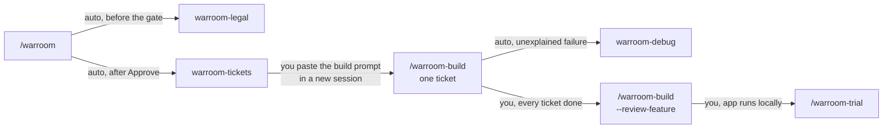
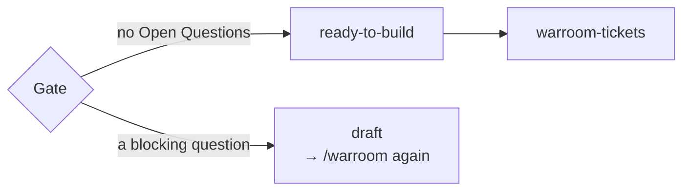
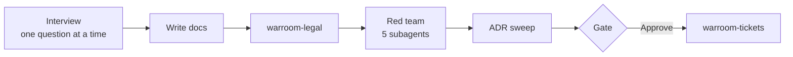
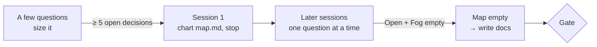
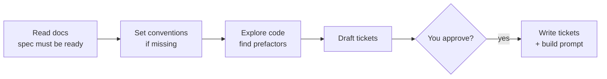
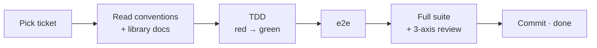
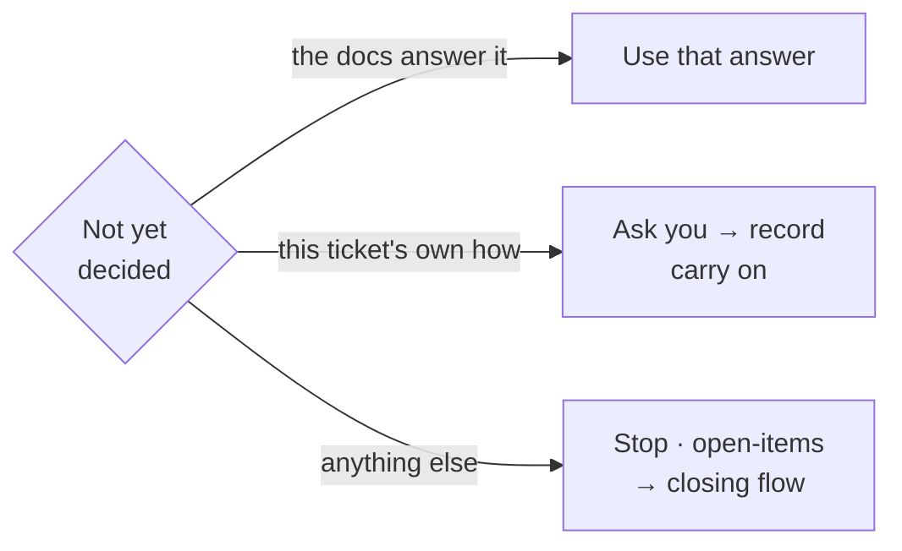
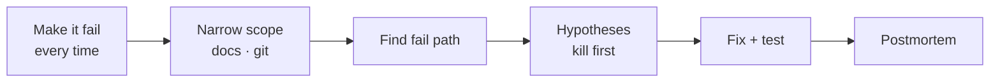
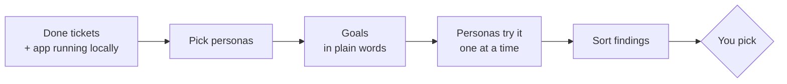

# How the warroom skills fit together

**English** · [ไทย](flow.th.md)

What to run, in what order; what each skill does; where it waits for you.

**Rule of thumb:** planning chains itself (warroom → legal → tickets) ·
building is one ticket per **new session** · debugging starts itself on a
failure the build can't explain · a trial is always your call.

## 1. The whole path



**"auto" chains inside one session · "you" means the skill stops for you**
- `/warroom-build` once per ticket, each in a new session, until all are done.
- What a trial finds → section 8 · picked findings become new tickets, and
  you go round build → review → trial until it's clean, then merge.
- legal and debug also run alone: `/warroom-legal`, `/warroom-debug`.

**What you type:**

```
/warroom                                          ← plan + tickets
/warroom-build auth-user-company                  ← new session per ticket, until all done
/warroom-build auth-user-company --review-feature
/warroom-trial auth-user-company
```

## 2. One gate upstream — the spec must be ready



A question not asked while planning gets asked mid-build — halfway through
code, with a nearly full context, and no red team or legal check behind the
answer. So it's stopped upstream.

- The spec has `Status: draft | ready-to-build` and `## Open Questions`.
- **Approve** is offered only when Open Questions is empty (or every entry says why it doesn't block).
- Not ready → **Stop as draft** gives a prompt to resume `/warroom` with the questions listed.
- tickets and build **refuse** a `draft` spec.

## 3. warroom — plan



One session — the gate is the only place you decide.

| Step | Does | You |
|---|---|---|
| Interview | one question at a time, a recommended choice · looks up code / ADRs / docs first · can't answer yet → Open Question | answer |
| Write docs | spec (with Library assumptions + Testing decisions), decisions (D1…), flow | — |
| legal | Thai law item by item → `legal.md` | answer if ambiguous |
| Red team | Advocate (user) · **Builder** (opens the real library docs, walks the work as its builder to find what would be asked) · Breaker (attacks) · Tester (testable?) · Skeptic (needed?) | decide what needs deciding |
| ADR sweep | finds project-wide decisions, drafts ADRs | — |
| Gate | summary + Open Questions | **Approve** / **Adjust** / **Stop as draft** |

**Leaves:** `docs/features/{slug}/` spec, decisions, flow, legal · `docs/adr/` · `CONTEXT.md`

**Re-opening a feature** (`/warroom {slug}`): asks only the `→ /warroom`
rows in `open-items.md` + Open Questions → new D → legal + Breaker → gate →
re-cut.

### 3.1 Map mode — too big for one session



About five or more open decisions, with answers that will raise new
questions → chart a map instead of interviewing until the context runs out.

| Section of `map.md` | Holds |
|---|---|
| Destination | where it ends, e.g. "a ready-to-build spec for …"; fixes the scope |
| Decided | one line each, linked to its D |
| Open | sharp questions + kind (interview / sketch / research / task) + what blocks them |
| Fog | areas you know are coming but can't phrase yet |
| Out of scope | past the destination; never comes back |

- Session 1 charts and **stops** · later `/warroom {slug}` sessions resolve one question at a time and **record before anything else**.
- Open + Fog empty → docs → legal → red team → ADR → gate as usual.

**In every interview:** ask the 2–3 qualities this feature really stresses
(speed/load, a dependency down, who sees the data) · never invent a why —
write `rationale not recorded` · words run out → a rough sketch (state
table, text mockup), never code · seams: reuse, highest, fewest · a pivot is
a new feature.

## 4. warroom-legal — Thai law

One verdict per item: **ALLOWED** (the citation) · **NOT ALLOWED** (the
reason) · **CONDITIONAL** (what must exist → into the spec and tickets) ·
an ambiguous item is asked, never guessed · not legal advice.

## 5. warroom-tickets — cut the work



| Step | Does | You |
|---|---|---|
| Read | spec `draft` → stop, send to `/warroom` · tickets exist → asks whether to re-cut (tickets not done are renumbered) | answer |
| Conventions | an area with no rules → proposes folders + test tools → `.claude/skills/{framework}-{surface}/` | accept / adjust |
| Explore | existing code to tidy → prefactor tickets first | — |
| Draft | each ticket screen to DB · walks each as its builder: structural choice → into conventions now · behaviour → back to `/warroom` | — |
| Approve | size, Blocked by, merge / split | answer until happy |
| Write | `tickets/NN-*.md` + build prompt (checks docs committed, branch, docker, secrets, open items) | commit, paste the prompt in a new session |

## 6. warroom-build — one ticket



**Why one ticket per session:** a clean context reads only what this
ticket needs · the review diffs only this ticket · one commit per ticket
reverts alone · memory lives in files (ticket, decisions, open-items), not
chat.

| Step | Does | You |
|---|---|---|
| Pick | the named ticket or the lowest one that can start · one left `in-progress` → reads its open-items rows, asks to resume | — |
| Prepare | conventions (none → stop → `/warroom-tickets`) · version table · `docs/reference/` notes for the installed version | answer upgrades (recommended: stay) |
| TDD | one criterion at a time, red → green, at the agreed seams | — |
| e2e | `(e2e)` criteria once the code is green | — |
| Check | full suite + typecheck + lint · **Standards / Spec / Newcomer** review in parallel | — |
| Commit | `feat({slug}): {title} (#NN)` · no push | new session, next ticket |

**Every ticket done** → `--review-feature`: the three axes over the whole
branch + the `→ feature review` rows → you pick what to fix.

### 6.1 When the build meets something the docs didn't decide



**The build implements decisions; it doesn't make them** — a decision made
during build skips the red team and legal.

| Case | Build does |
|---|---|
| found by searching (all decisions, ADRs, spec, conventions, reference) | uses it, no question |
| only this ticket's how (error wording, a default, a new layer's pattern) | asks, saying where it looked → a new D or conventions, settled completely → carries on |
| touches the spec / another ticket / legal / an ADR / an old D · can't build as cut · docs contradict · unsure | stops → open-items row (`→ /warroom` or `→ /warroom-tickets`) |
| unexplained error | calls debug → fix → carries on |
| test already broken | doesn't fix → row `→ /warroom-debug` |
| review outside the ticket | row `→ feature review` |
| too big for one session | stops at the end of a criteria group, commits what's green as `wip` · row `→ /warroom-build` |

**Never ends a session with uncommitted code** — asks: keep it on branch
`wip/{slug}-{NN}` (recommended) or discard · notes the branch in the row.

## 7. warroom-debug — find a bug's cause



No guessing before it fails reliably · every step goes into
`docs/debug/{date}-{slug}.md` as it happens.

- Can't make it fail → stops, asks for logs · row `→ /warroom-debug`.
- Code does exactly what the docs say → a spec gap, not a bug · row `→ /warroom`.
- Every experiment goes in the ledger · an **Outsider** subagent reads only the record for a fresh view.
- Blameless postmortem · prevention work is asked first; only a yes makes a ticket.

## 8. warroom-trial — role-played users try the app



Personas are subagents that **see no code and no spec**, use a real
browser, and answer in the app's language · trial fixes nothing itself.

| Kind | Meaning | Picked → |
|---|---|---|
| **bug** | the app contradicts the spec | debug now, fix + test (e2e when seen on screen) |
| **spec gap** | the spec is silent or wrong | row `→ /warroom` |
| **friction** | matches the spec, hard to use | new ticket with an `(e2e)` criterion |
| **works as intended** | expected something a D ruled out | noted, citing the D |

Unpicked → `open` in `trial/{date}.md` · trial doesn't commit.

## 9. `open-items.md` — everything unfinished, one place

```
| # | Ticket | From         | Found                        | Next               | Status      |
| 1 | 04     | build stop   | needs a session store first  | → /warroom-tickets | → ticket 05 |
| 2 | 04     | review: Spec | ...                          | → feature review   | open        |
| 3 | 06     | decision     | sign out on suspend at once? | → /warroom         | → D32       |
| 4 | —      | trial        | ...                          | → /warroom         | open        |
```

| Column | Meaning |
|---|---|
| **From** | where it came from: `build stop`, `decision`, `review: {axis}`, `feature review`, `full suite`, `debug`, `trial` |
| **Next** | the flow that closes it: `→ /warroom`, `→ /warroom-tickets`, `→ /warroom-debug`, `→ /warroom-build`, `→ feature review` |
| **Status** | `open` until that flow closes it → `→ ticket NN` / `→ D{n}` / `done (sha)` / `dropped (why)` |

The closing skill updates Status · no build prompt while a `→ /warroom` or
`→ /warroom-tickets` row is open · `--review-feature` won't recommend merge
while any row is `open`.

## Words

| Word | Meaning |
|---|---|
| **D{n}** | one decision in `decisions.md` |
| **ADR** | a project-wide rule later features must follow (`docs/adr/`) |
| **seam** | where a test observes behaviour (a route, a service), agreed in the spec |
| **(e2e)** | behaviour only visible on screen, checked with the project's e2e tool (e.g. Playwright) |
| **Blocked by** | tickets that must be done first; always lower numbers |
| **frontier** | tickets that can start now |
| **prefactor** | a ticket that tidies existing code first; numbered first |
| **conventions** | the project's coding rules, `.claude/skills/{framework}-{surface}/` |
| **persona** | a role-played user in a trial |

## What each one leaves behind

| Skill | Files |
|---|---|
| `warroom` | `docs/features/{slug}/` spec, decisions, flow (+ `map.md` for big plans) · `docs/adr/` · `CONTEXT.md` |
| `warroom-legal` | `legal.md` |
| `warroom-tickets` | `tickets/NN-*.md` · `.claude/skills/{framework}-{surface}/` |
| `warroom-build` | code + tests, one commit per ticket · `docs/reference/` · `open-items.md` rows |
| `warroom-debug` | `docs/debug/{date}-{slug}.md` · `open-items.md` rows |
| `warroom-trial` | `trial/{date}.md` · new tickets · `open-items.md` rows |
