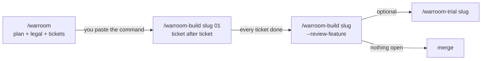
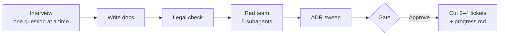
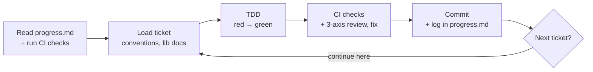
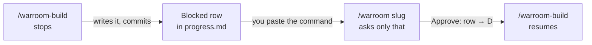
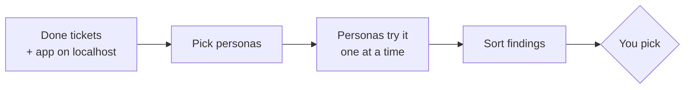

# How the warroom skills fit together

**English** · [ไทย](flow.th.md)

Three skills: **warroom** plans and cuts tickets, **warroom-build** builds
them, **warroom-trial** lets role-played users try the result. Where
everything stands is always in one file: `docs/features/{slug}/progress.md`.

## 1. The whole path



**Every skill ends with the next command, ready to paste.**
- You never work out what to run: copy the code block at the end of the reply.
- Builds continue from ticket to ticket in one session; the build asks before each next one.
- A trial's picked findings become one fix ticket → back to `/warroom-build`.

**What you type:**

```
/warroom                                   ← plan, legal, tickets
/warroom-build company-user 01             ← then whatever command it ends with
/warroom-build company-user --review-feature
/warroom-trial company-user                ← optional
```

Other modes: `/warroom legal {items}` (legal check only) ·
`/warroom tickets {slug}` (re-cut) · `/warroom-build debug {symptom}`
(any bug).

## 2. warroom — plan, then cut



| Step | Does | You |
|---|---|---|
| Interview | one question at a time, a recommended choice; looks up code, ADRs, and docs first; can't answer yet → Open Question | answer |
| Write docs | spec, decisions (D1…), flow | — |
| Legal | Thai law item by item → `legal.md`; `UNVERIFIED` blocks the gate | answer if ambiguous |
| Red team | Advocate, Builder, Breaker, Tester, Skeptic | decide what needs deciding |
| ADR sweep | finds project-wide decisions, drafts ADRs | — |
| Gate | summary + Open Questions | **Approve** / **Adjust** / **Stop as draft** |
| Tickets | conventions where missing; 2–4 big vertical tickets; `progress.md` | approve, merge, or split |

**Approve** is offered only when no Open Question blocks building. The
spec stays `draft` until then, and the build refuses a `draft`.

**Big plan?** About five or more open decisions → session 1 charts a
`map.md` and stops; later `/warroom {slug}` sessions settle it one question
at a time, then the steps above run as usual.

## 3. warroom-build — ticket after ticket



- **Starts** by reading `progress.md` — what earlier tickets built and left for this one — and running every CI check, so anything already red is known.
- **Checks** use CI's exact commands; no commit while a check this ticket broke is red.
- **Review** findings are fixed in the ticket, not parked.
- **Ends each ticket** with a summary in `progress.md` (shown in chat), then asks: continue here, or stop with the next command.
- After two big tickets, it recommends a new session.

### 3.1 When the docs don't settle something

| Case | Build does |
|---|---|
| the docs answer it | uses the answer |
| small, inside the feature (a default, a message, a limit) | decides, records a D, lists it in the log |
| something the user would notice, a legal item, or an ADR | asks you; stays inside the spec → a D, carries on |
| it changes what the spec promises, or you want to wait | Blocked row → stops with `/warroom {slug}` |
| a failure it can't explain | debugs it reproduce-first, then carries on |

## 4. `progress.md` — where everything stands

```
**Now:** 02 done; 03 next
**Next:**  /warroom-build company-user 03

## Tickets      01 done · 02 done · 03 ready
## Log          per finished ticket: Built · Decided · For the next ticket · Checks
## Blocked      only what the build may not settle itself
```

Every build session reads it first and writes it last. **For the next
ticket** is how one ticket tells the next what it must know.

## 5. Going back — a Blocked row



| The row needs | You run | It closes as |
|---|---|---|
| `/warroom {slug}` | the command the build ended with | `→ D{n}` |
| `/warroom tickets {slug}` | the same | `→ ticket NN` |
| `/warroom-build debug {symptom}` | the same, once the logs or data are in | `done ({sha})` |

You don't edit `progress.md` yourself. To drop a row, tell the skill.

## 6. warroom-trial — role-played users



Personas are subagents that see **no code and no spec**.

| Kind | Picked → |
|---|---|
| **bug** / **friction** | all into one new fix ticket → `/warroom-build {slug} {NN}` |
| **spec gap** | Blocked row → `/warroom {slug}` |
| **works as intended** | noted, citing the D |

## The folders it leaves

```
docs/
├── README.md                    ← what each folder is for
├── features/{slug}/
│   ├── spec.md  decisions.md  flow.md  legal.md  progress.md  (map.md)
│   ├── tickets/                 ← 2–4 tickets, one file each
│   ├── user-trials/             ← trial reports
│   └── bugs/                    ← bug investigations for this feature
├── adr/                         ← rules every feature must follow
├── library-notes/               ← what each library's docs recommend, for the installed version
├── bugs/                        ← bugs outside any feature
└── legal/                       ← standalone legal checks
.claude/skills/{framework}-{surface}/   ← the project's coding conventions
```

## Words

| Word | Meaning |
|---|---|
| **D{n}** | one decision in `decisions.md` |
| **ADR** | a project-wide rule later features must follow (`docs/adr/`) |
| **seam** | where a test observes behaviour, agreed in the spec |
| **(e2e)** | behaviour only visible on screen, checked with the project's e2e tool |
| **Blocked** | a row in `progress.md` the build may not settle itself |
| **conventions** | the project's coding rules, `.claude/skills/{framework}-{surface}/` |
| **persona** | a role-played user in a trial |
