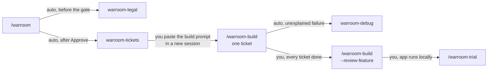
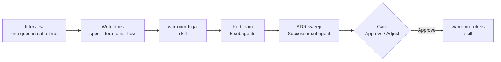
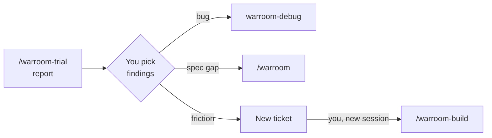

# How the warroom skills fit together

**English** · [ไทย](flow.th.md)

Which skill you start, which ones it calls on its own, and where it stops
and hands back to you.

**Rule of thumb:** planning chains itself (warroom → warroom-legal →
warroom-tickets). Building is one ticket per **new session**, started by
you. Debugging starts itself when a build hits a failure it can't explain.
A trial is always your call.

## 1. The whole path

**From plan to trial: solid arrows labelled "auto" happen inside the same
run; "you" means the skill stops and waits for you.**
- Run `/warroom-build` once per ticket, each in a new session, until every
  ticket is `done` — the build names the next ticket when it finishes.
- warroom-debug returns its fix and regression test to the build that
  called it; run it yourself with `/warroom-debug` for any bug outside a
  build.
- warroom-legal also runs alone as `/warroom-legal {items or slug}`.

## 2. Inside one warroom run

**Everything in this row happens in one session; the gate is the only
place you decide.** Adjust folds your changes into the docs and shows the
gate again — a changed decision is re-checked by warroom-legal and The
Breaker first.

## 3. Where trial findings go

**Nothing is fixed until you pick.** Unpicked findings stay `open` in the
trial report.
- **bug** — debug builds a repro from the persona's steps, fixes behind a
  regression test (an e2e test when it showed on screen), and commits the
  fix, test, and record together.
- **spec gap** — trial never edits the spec; `/warroom` adds a `D{n}` and
  cuts more tickets.
- **friction** — a new ticket after the highest number, with the persona's
  goal as an `(e2e)` criterion so it doesn't come back.
- New tickets built → `--review-feature` → `/warroom-trial` again to check
  the old findings are gone.

## Each skill at a glance

| Skill | You start it with | It calls on its own | It stops when | Then you |
|---|---|---|---|---|
| `warroom` | `/warroom` | warroom-legal, 5 red-team subagents, Successor subagent, warroom-tickets | tickets are written | paste the build prompt in a new session |
| `warroom-legal` | runs inside warroom, or `/warroom-legal` | — | `legal.md` is written | — (warroom continues) |
| `warroom-tickets` | runs after the warroom gate, or `/warroom-tickets {slug}` | — | tickets + a build prompt are shown | commit the docs, paste the prompt |
| `warroom-build` | `/warroom-build {slug} [NN]` or the pasted prompt | Standards / Spec / Newcomer review subagents, warroom-debug on unexplained failures | one ticket is committed | open a new session for the next ticket |
| `warroom-build --review-feature` | `/warroom-build {slug} --review-feature` | the same three review subagents | picked fixes are committed | merge or open a PR; run a trial |
| `warroom-debug` | called by warroom-build, or `/warroom-debug` | Outsider subagent | fix + regression test + record in `docs/debug/` | — (the build continues) or commit the fix |
| `warroom-trial` | `/warroom-trial {slug}` | one persona subagent at a time | report written, your picks routed | build new tickets, debug, or re-run warroom |

## What each one leaves behind

| Skill | Files |
|---|---|
| `warroom` | `docs/features/{slug}/` spec.md, decisions.md, flow.md · `docs/adr/` · `CONTEXT.md` |
| `warroom-legal` | `docs/features/{slug}/legal.md` |
| `warroom-tickets` | `docs/features/{slug}/tickets/NN-*.md` · `.claude/skills/{framework}-{surface}/` (project conventions, when missing) |
| `warroom-build` | code + tests, one commit per ticket · `docs/reference/` notes |
| `warroom-debug` | `docs/debug/{date}-{slug}.md` |
| `warroom-trial` | `docs/features/{slug}/trial/{date}.md` · new tickets for the friction you pick |
