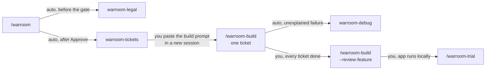
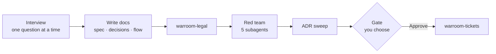
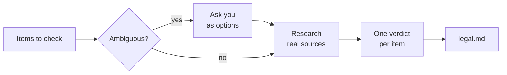
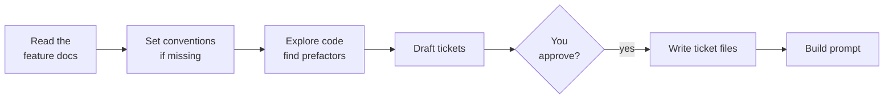
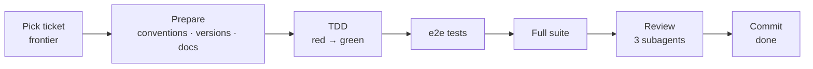
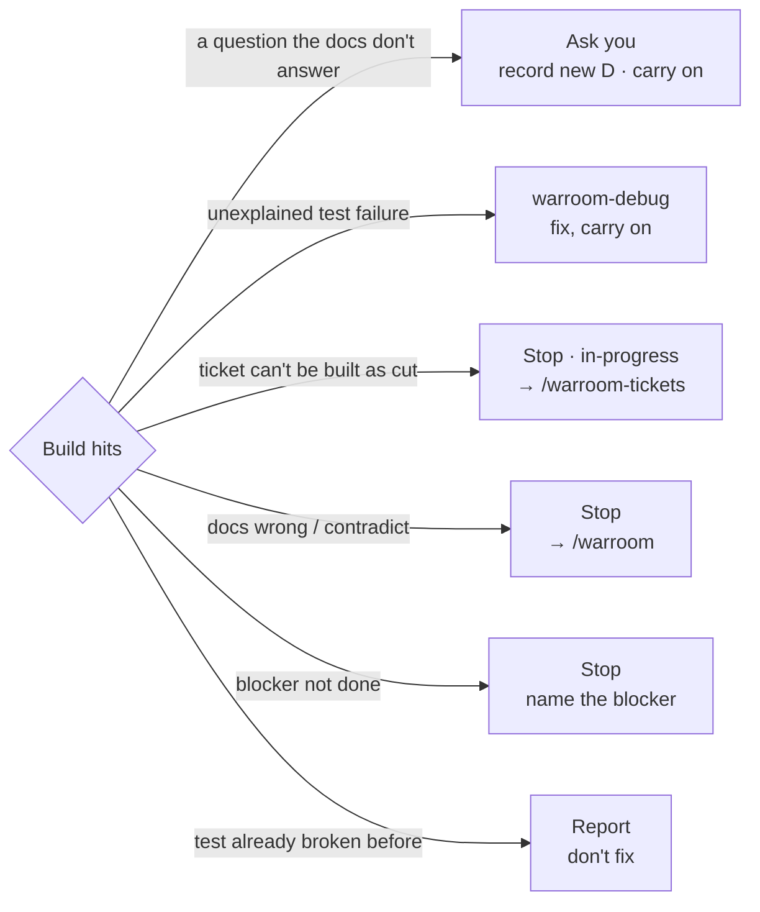
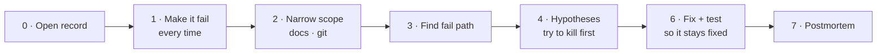
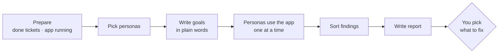
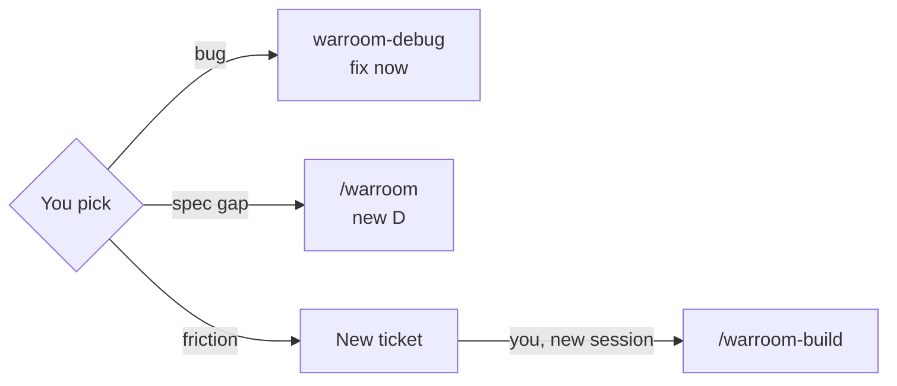

# How the warroom skills fit together

**English** · [ไทย](flow.th.md)

This guide answers three questions: what to run, in what order, to ship
one feature; what each skill does inside; and where it stops and waits for
you.

Examples use a feature slug `auth-user-company`.

## Read this first — the whole thing in one paragraph

You describe what you want → **warroom** asks one question at a time and
writes the plan as docs → **warroom-tickets** cuts the plan into small
numbered pieces 01, 02, … → **warroom-build** writes the code one piece per
session → once every piece is done, **--review-feature** reviews the whole
branch → **warroom-trial** lets role-played users try the running app and
reports where they got stuck → what they found becomes new pieces, and you
build again.

**warroom-legal** (Thai law) and **warroom-debug** (finding a bug's cause)
are helpers the other skills call along the way.

## Words you'll see

| Word | Meaning |
|---|---|
| **feature / slug** | One piece of work, named by a slug such as `auth-user-company`; its docs live in `docs/features/{slug}/` |
| **D{n}** | One decision in `decisions.md`, e.g. D28 "never expires = 400 days" |
| **ADR** | A project-wide decision every later feature must follow, in `docs/adr/` |
| **seam** | A place a test can observe behaviour (an API route, a service function), agreed in spec.md |
| **(e2e)** | Behaviour only visible on screen; checked by Playwright in a real browser |
| **ticket** | One piece that works end to end, screen to database: `tickets/NN-*.md` |
| **Status** | A ticket's state: `ready-for-agent` (waiting) → `in-progress` → `done` |
| **Blocked by** | Tickets that must be done first; always lower numbers |
| **frontier** | Tickets that can start now: the lowest-numbered waiting one whose blockers are all `done` |
| **prefactor** | A ticket that tidies existing code first; always numbered first |
| **conventions** | The project's coding rules, kept in `.claude/skills/{framework}-{surface}/`, e.g. `elysia-api` |
| **persona** | A role-played user in a trial, e.g. "a company owner adding staff before Monday" |
| **subagent** | Another Claude a skill sends off on its own; it sees only what it is given |

## 1. The whole path



**From plan to trial: solid arrows labelled "auto" happen inside the same
run; "you" means the skill stops and waits for you.**
- Run `/warroom-build` once per ticket, each in a new session, until every
  ticket is `done` — the build names the next ticket when it finishes.
- warroom-debug returns its fix and regression test to the build that
  called it; run it yourself with `/warroom-debug` for any bug outside a
  build.
- warroom-legal also runs alone as `/warroom-legal {items or slug}`.
- What a trial finds → see section 7. The ones you pick become new
  tickets, and you go round again: `/warroom-build` → `--review-feature` →
  `/warroom-trial`, until nothing important is left, then merge.

**What you actually type, in order:**

```
/warroom                                        ← plan + tickets (one session)
/warroom-build auth-user-company                ← new session per ticket, until all done
/warroom-build auth-user-company --review-feature
/warroom-trial auth-user-company
```

## 2. warroom — plan



Every step runs in one session — the gate is the only place you decide.

| Step | What it does | What you do |
|---|---|---|
| Interview | One question at a time, choices with a recommended one | answer / pick |
| Write docs | `spec.md` (what), `decisions.md` (D1, D2, …), `flow.md` (diagrams) | — |
| warroom-legal | Checks Thai law item by item → `legal.md` | answer if an item is ambiguous |
| Red team | 5 subagents look for holes: Advocate (the user), Builder (buildable?), Breaker (attacks), Tester (testable?), Skeptic (needed?) | — |
| ADR sweep | Finds decisions that should become project rules; drafts ADRs | — |
| Gate | Shows the summary | **Approve** = go on / **Adjust** = change and see the gate again |

**Leaves:** `docs/features/{slug}/` spec.md, decisions.md, flow.md,
legal.md · `docs/adr/` · `CONTEXT.md`

## 3. warroom-legal — Thai law



Every item gets one of three verdicts.

- **ALLOWED** — just the citation.
- **NOT ALLOWED** — the reason.
- **CONDITIONAL** — allowed if the listed things exist, e.g. "a privacy notice"; those go into the spec and tickets.

Runs alone as `/warroom-legal {items or slug}` · not legal advice.

## 4. warroom-tickets — cut the work



It drafts and asks until you're happy — several rounds before any file is
written.

| Step | What it does | What you do |
|---|---|---|
| Read docs | spec, decisions, flow, legal, CONTEXT; `tickets/` exists → asks whether to re-cut | answer |
| Conventions | An area with no rules yet (e.g. `tanstack-start-web`) → proposes folders and test tools | accept / adjust |
| Explore code | Finds existing code to tidy first → prefactor tickets numbered first | — |
| Draft | Each ticket works end to end, screen to DB (not "all the DB first") | — |
| Quiz | Too big or small? Blocked by right? Merge or split? | answer until happy |
| Write | `tickets/NN-*.md`, all `ready-for-agent` | — |
| Build prompt | Checks the project (docs committed? branch, docker, tests, library versions, secrets) and gives an English prompt | run the steps it lists, paste the prompt in a new session |

**Leaves:** `tickets/NN-*.md` · `.claude/skills/{framework}-{surface}/` (when just set up) · no commit

## 5. warroom-build — code one ticket



One session = one ticket — it ends in a commit on the feature branch, no
push.

| Step | What it does | What you do |
|---|---|---|
| Pick | The named ticket or the frontier; a blocker not done → stop | — |
| Prepare | Reads the project conventions · version table (installed vs latest) · reads the library's real docs (`llms.txt` first) into `docs/reference/` | answer upgrade questions (recommended: stay) |
| TDD | One criterion at a time: a failing test (red) → code that passes (green) | answer anything the docs don't → becomes a new D |
| e2e | Criteria tagged `(e2e)` get a Playwright test once the code is green | — |
| Full suite | All tests + typecheck + lint (+ e2e) | — |
| Review | 3 subagents at once: **Standards** (follows the rules?), **Spec** (matches the ticket?), **Newcomer** (readable cold?); fixes what's in scope | — |
| Commit | Ticket `done` · `feat({slug}): {title} (#NN)` | close the session, open a new one for the next ticket |

- **A failure it can't explain** → calls warroom-debug, then carries on.
- **Every ticket done** → `/warroom-build {slug} --review-feature`: the
  same three axes over the whole branch, looking for cross-ticket problems
  (built twice, named two ways). You pick what to fix → commit
  `refactor({slug}): feature review fixes`.

**Why one ticket per session**
- **A clean context** — in a long session Claude starts forgetting or mixing old and new. Each ticket starts fresh and reads only what it needs.
- **A focused review** — the review diffs from the ticket's own start commit, not mixed with other tickets.
- **Easy to undo** — one ticket = one commit; revert just the one that broke.
- **Memory lives in files, not chat** — the ticket, decisions.md, and `## Notes` carry over to the next session.

## 5.1 When the build hits something unexpected



The build never redesigns — a real choice always goes to you; anything
outside the ticket stops and says where to go.

| What happens | The build | You |
|---|---|---|
| **A new decision** — the docs don't answer (e.g. "which language are error messages in") | asks with a recommended option, records the next D in `decisions.md`, carries on | pick |
| **An unexplained error** | calls warroom-debug in the same session, gets a fix + test, carries on | answer if debug asks |
| **Debug can't reproduce it** | record `blocked: {what is needed}`, stops | send the logs or data asked for |
| **The ticket can't be built as cut** (too big, needs other work first) | stops, leaves it `in-progress`, writes why under `## Notes` | run `/warroom-tickets {slug}` to re-cut — tickets not done are renumbered |
| **The docs are wrong or contradict each other** | stops, recommends `/warroom` | run `/warroom`, change the D → re-cut |
| **A blocker isn't done** | stops, names it | build that one first |
| **A test that was already broken** (not by this ticket) | reports, doesn't fix | decide whether to debug it |
| **Review findings outside the ticket** | fixes what's in scope, writes the rest under `## Notes` | see them at `--review-feature` |
| **A ticket too big for one session** | stops at the end of an acceptance group, never commits half a group | new session, `/warroom-build {slug}` |

**Where unfinished work waits**
- A ticket `in-progress` — the next `/warroom-build {slug}` reads its `## Notes` and asks whether to resume.
- Review findings left — each ticket's `## Notes`; `--review-feature` sees them all.
- Trial findings not picked — `open` in `trial/{date}.md`.
- A stuck debug — `docs/debug/` with status `blocked: …`.

## 6. warroom-debug — find a bug's cause



No guessing a cause before it fails every time — every step is written to
`docs/debug/{date}-{slug}.md` as it happens.

- **Step 1, can't make it fail** → stop, ask you for logs or more data; no guessing.
- **Step 2, the code does exactly what the docs say** → not a bug but a spec gap → recommends `/warroom`.
- **Steps 4–5** every experiment goes in the ledger (a table); a hypothesis must explain every row. An **Outsider** subagent reads only the record and gives a fresh view.
- **Step 7** blameless: what let this happen, and how to stop it next time. Prevention work → asks you first; only a yes makes a new ticket.
- **Commit:** called by build → the fix goes in the ticket's commit · run alone → commits fix, test, and record together.

## 7. warroom-trial — role-played users try the app



Trial fixes nothing itself — it writes a report and lets you pick.

| Step | What it does | What you do |
|---|---|---|
| Prepare | Tries only `done` tickets and says which it skipped and why · runs the app locally (localhost only, test data only) · mobile uses the dev build in a simulator | start docker / answer |
| Personas | The spec's actors + the real roles you name (a manager, a first-day employee, someone in a hurry on a phone), 3–5 people | tick |
| Goals | 3–6 each, in plain words: "get the new hire in before Monday", not "click Create" | review / adjust |
| Use the app | One subagent each, **no code, no spec**, a real browser; answers in the app's language like a real user | — |
| Sort | Acts as dev lead: checks against the spec, sorts by kind (table below), merges duplicates, counts who hit each | — |
| Report | `trial/{date}.md`, blocked goals first | — |
| Pick | Asks which to act on now | tick |

**Where each kind of finding goes:**



Unpicked findings stay `open` in the report.

| Kind | Meaning | Next |
|---|---|---|
| **bug** | The app contradicts the spec | debug repros from the persona's steps, fixes with a test (e2e when seen on screen), commits |
| **spec gap** | The spec is silent or wrong for a real goal | trial never edits the spec · you run `/warroom`, add a D, cut tickets |
| **friction** | Matches the spec but hard or confusing | a new ticket after the highest number, with the persona's goal as an `(e2e)` criterion |
| **works as intended** | The user expected something a D ruled out | noted, citing the D |

**After you pick:** trial doesn't commit — commit the report and new
tickets yourself, build the new tickets → `--review-feature` → trial again.

## Each skill at a glance

| Skill | You start it with | It calls on its own | It stops when | Then you |
|---|---|---|---|---|
| `warroom` | `/warroom` | warroom-legal, 5 red-team subagents, Successor subagent, warroom-tickets | tickets are written | paste the build prompt in a new session |
| `warroom-legal` | runs inside warroom, or `/warroom-legal` | — | `legal.md` is written | — (warroom continues) |
| `warroom-tickets` | runs after the warroom gate, or `/warroom-tickets {slug}` | — | tickets + a build prompt are shown | commit the docs, paste the prompt |
| `warroom-build` | `/warroom-build {slug} [NN]` or the pasted prompt | Standards / Spec / Newcomer review subagents, warroom-debug | one ticket is committed | open a new session for the next ticket |
| `warroom-build --review-feature` | `/warroom-build {slug} --review-feature` | the same three review subagents | picked fixes are committed | run a trial or merge |
| `warroom-debug` | called by build / trial, or `/warroom-debug` | Outsider subagent | fix + test + record | — (the build continues) |
| `warroom-trial` | `/warroom-trial {slug}` | one persona subagent at a time, warroom-debug | report written, your picks routed | commit, build new tickets, or re-run warroom |

## What each one leaves behind

| Skill | Files |
|---|---|
| `warroom` | `docs/features/{slug}/` spec.md, decisions.md, flow.md · `docs/adr/` · `CONTEXT.md` |
| `warroom-legal` | `docs/features/{slug}/legal.md` |
| `warroom-tickets` | `docs/features/{slug}/tickets/NN-*.md` · `.claude/skills/{framework}-{surface}/` (when missing) |
| `warroom-build` | code + tests, one commit per ticket · `docs/reference/` notes |
| `warroom-debug` | `docs/debug/{date}-{slug}.md` |
| `warroom-trial` | `docs/features/{slug}/trial/{date}.md` · new tickets for the friction you pick |
