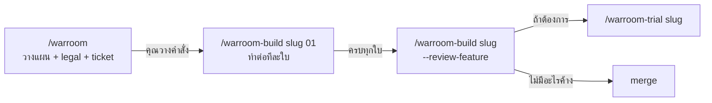
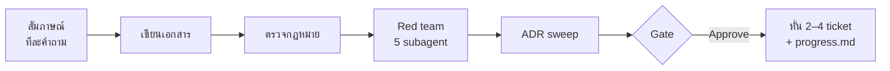
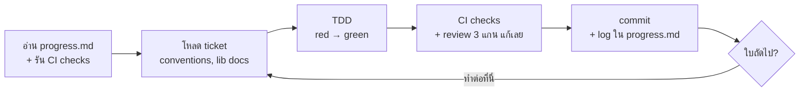
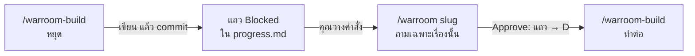
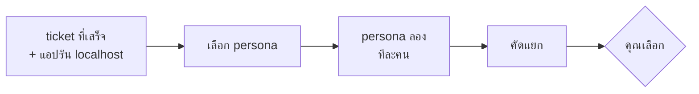

# skill ของ warroom ทำงานต่อกันยังไง

[English](flow.md) · **ไทย**

มี 3 skill: **warroom** วางแผนและหั่น ticket, **warroom-build** สร้างตาม
ticket, **warroom-trial** ให้ผู้ใช้สมมุติลองใช้ ความคืบหน้าทั้งหมดอยู่ในไฟล์เดียว:
`docs/features/{slug}/progress.md`

## 1. ภาพรวม



**ทุก skill จบด้วยคำสั่งถัดไปที่พร้อมก๊อป**
- ไม่ต้องคิดว่าจะรันอะไรต่อ ก๊อป code block ท้ายข้อความไปวาง
- build ทำต่อใบถัดไปใน session เดิมได้ โดยถามคุณก่อนทุกครั้ง
- ข้อที่คุณเลือกจาก trial รวมเป็น fix ticket ใบเดียว → กลับไป `/warroom-build`

**สิ่งที่คุณพิมพ์:**

```
/warroom                                   ← วางแผน, legal, ticket
/warroom-build company-user 01             ← แล้วรันคำสั่งที่มันให้ตอนจบ
/warroom-build company-user --review-feature
/warroom-trial company-user                ← ถ้าต้องการ
```

โหมดอื่น: `/warroom legal {รายการ}` (ตรวจกฎหมายอย่างเดียว) ·
`/warroom tickets {slug}` (หั่นใหม่) · `/warroom-build debug {อาการ}`
(bug อะไรก็ได้)

## 2. warroom — วางแผน แล้วหั่น ticket



| ขั้น | ทำอะไร | คุณ |
|---|---|---|
| สัมภาษณ์ | ถามทีละข้อ มีตัวเลือกแนะนำ; ค้นโค้ด ADR docs ก่อนถาม; ตอบไม่ได้ → Open Question | ตอบ |
| เขียนเอกสาร | spec, decisions (D1…), flow | — |
| กฎหมาย | ทีละเรื่อง → `legal.md`; `UNVERIFIED` บล็อก gate | ตอบถ้ากำกวม |
| Red team | Advocate, Builder, Breaker, Tester, Skeptic | ตัดสินเรื่องที่ต้องตัดสิน |
| ADR sweep | หา decision ระดับโปรเจค ร่าง ADR | — |
| Gate | สรุป + Open Questions | **Approve** / **Adjust** / **Stop as draft** |
| Ticket | ตั้ง conventions ถ้ายังไม่มี; 2–4 ticket ใบใหญ่แนวตั้ง; `progress.md` | อนุมัติ, รวม หรือแยก |

กด **Approve** ได้เมื่อไม่มี Open Question ที่บล็อกการ build ก่อนหน้านั้น spec
เป็น `draft` และ build จะไม่รับ

**แผนใหญ่?** ประมาณ 5 เรื่องขึ้นไปที่ยังไม่ตัดสิน → session แรกทำ `map.md` แล้ว
หยุด session ต่อๆ ไปรัน `/warroom {slug}` ตอบทีละคำถาม แล้วค่อยทำขั้นข้างบนตามปกติ

## 3. warroom-build — ทำทีละใบต่อเนื่อง



- **เริ่ม** ด้วยการอ่าน `progress.md` — ใบก่อนทำอะไรไป ฝากอะไรไว้ — และรัน CI check ทั้งหมด จะได้รู้ว่าอะไรพังอยู่ก่อนแล้ว
- **ตรวจ** ด้วยคำสั่งเดียวกับ CI; ไม่ commit ถ้ายังมี check ที่ใบนี้ทำพัง
- **Review** เจออะไรแก้ในใบนั้นเลย ไม่เก็บไว้ทีหลัง
- **จบแต่ละใบ** เขียนสรุปใน `progress.md` (โชว์ในแชทด้วย) แล้วถาม: ทำต่อที่นี่ หรือหยุดพร้อมคำสั่งถัดไป
- ทำใบใหญ่ไป 2 ใบแล้ว จะแนะนำให้เปิด session ใหม่

### 3.1 เจอเรื่องที่เอกสารไม่ได้ตัดสิน

| กรณี | build ทำ |
|---|---|
| เอกสารตอบไว้แล้ว | ใช้คำตอบนั้น |
| เรื่องเล็กใน feature (ค่า default, ข้อความ, limit) | ตัดสินเอง บันทึกเป็น D แล้วใส่ใน log |
| เรื่องที่ผู้ใช้เห็น, กฎหมาย หรือ ADR | ถามคุณ; ยังอยู่ในกรอบ spec → เป็น D แล้วทำต่อ |
| เปลี่ยนสิ่งที่ spec สัญญาไว้ หรือคุณอยากคิดก่อน | แถว Blocked → หยุดพร้อม `/warroom {slug}` |
| error ที่อธิบายไม่ได้ | debug แบบทำให้ fail ได้ก่อน แล้วทำต่อ |

## 4. `progress.md` — ทุกอย่างอยู่ที่นี่

```
**Now:** 02 เสร็จ; ต่อไป 03
**Next:**  /warroom-build company-user 03

## Tickets      01 done · 02 done · 03 ready
## Log          ต่อใบที่เสร็จ: Built · Decided · For the next ticket · Checks
## Blocked      เฉพาะเรื่องที่ build ตัดสินเองไม่ได้
```

build ทุก session อ่านไฟล์นี้ก่อน และเขียนเป็นอย่างสุดท้าย **For the next
ticket** คือช่องที่ใบหนึ่งบอกใบถัดไปว่าต้องรู้อะไร

## 5. กลับไปแก้ — แถว Blocked



| แถวต้องการ | คุณรัน | ปิดเป็น |
|---|---|---|
| `/warroom {slug}` | คำสั่งที่ build ให้ตอนหยุด | `→ D{n}` |
| `/warroom tickets {slug}` | เหมือนกัน | `→ ticket NN` |
| `/warroom-build debug {อาการ}` | เหมือนกัน เมื่อได้ log หรือข้อมูลแล้ว | `done ({sha})` |

คุณไม่ต้องแก้ `progress.md` เอง ถ้าจะทิ้งแถวไหน บอก skill

## 6. warroom-trial — ผู้ใช้สมมุติลองแอป



persona เป็น subagent ที่ **ไม่เห็นโค้ด ไม่เห็น spec**

| ประเภท | เลือกแล้ว → |
|---|---|
| **bug** / **friction** | รวมเป็น fix ticket ใบเดียว → `/warroom-build {slug} {NN}` |
| **spec gap** | แถว Blocked → `/warroom {slug}` |
| **works as intended** | จดไว้ อ้าง D |

## โฟลเดอร์ที่ได้

```
docs/
├── README.md                    ← แต่ละโฟลเดอร์มีไว้ทำอะไร
├── features/{slug}/
│   ├── spec.md  decisions.md  flow.md  legal.md  progress.md  (map.md)
│   ├── tickets/                 ← 2–4 ticket ใบละไฟล์
│   ├── user-trials/             ← รายงาน trial
│   └── bugs/                    ← การไล่ bug ของ feature นี้
├── adr/                         ← กฎที่ทุก feature ต้องทำตาม
├── library-notes/               ← docs library แนะนำอะไร สำหรับเวอร์ชันที่ติดตั้ง
├── bugs/                        ← bug นอก feature
└── legal/                       ← ตรวจกฎหมายแบบเดี่ยว
.claude/skills/{framework}-{surface}/   ← กติกาการเขียนโค้ดของโปรเจค
```

## ศัพท์

| คำ | ความหมาย |
|---|---|
| **D{n}** | decision หนึ่งข้อใน `decisions.md` |
| **ADR** | กฎระดับโปรเจคที่ feature ต่อไปต้องทำตาม (`docs/adr/`) |
| **seam** | จุดที่ test สังเกตพฤติกรรม ตกลงไว้ใน spec |
| **(e2e)** | พฤติกรรมที่เห็นได้บนจอเท่านั้น ตรวจด้วย e2e tool ของโปรเจค |
| **Blocked** | แถวใน `progress.md` ที่ build ตัดสินเองไม่ได้ |
| **conventions** | กติกาเขียนโค้ดของโปรเจค `.claude/skills/{framework}-{surface}/` |
| **persona** | ผู้ใช้สมมุติใน trial |
