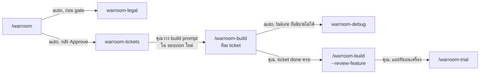
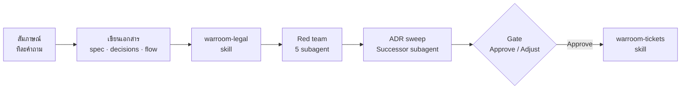
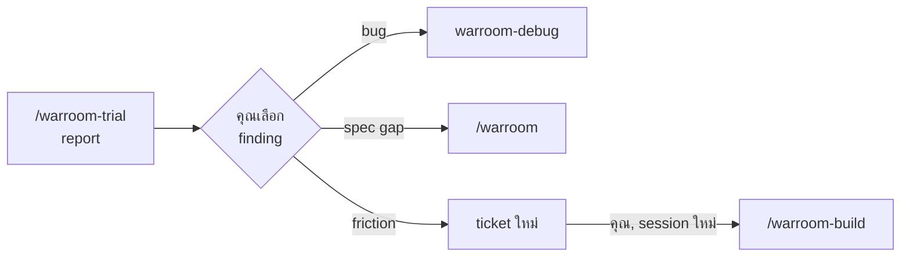

# skill ตระกูล warroom ทำงานต่อกันอย่างไร

[English](flow.md) · **ไทย**

เริ่มจาก skill ไหน, skill ไหนเรียกต่อเอง, และจุดไหนที่หยุดรอให้คุณสั่งต่อ

**หลักจำง่าย:** ช่วงวางแผนต่อกันเอง (warroom → warroom-legal →
warroom-tickets) ช่วง build ทำทีละ ticket ต่อหนึ่ง **session ใหม่** โดยคุณเป็นคนสั่ง
debug เริ่มเองเมื่อ build เจอ failure ที่อธิบายไม่ได้ ส่วน trial คุณเป็นคนตัดสินใจเสมอ

## 1. เส้นทางทั้งหมด

**จากแผนถึง trial: ลูกศรที่เขียนว่า "auto" เกิดใน run เดียวกัน ส่วน "คุณ"
คือ skill หยุดรอคุณ**
- รัน `/warroom-build` ทีละ ticket แต่ละครั้งใน session ใหม่ จนทุก ticket
  เป็น `done` — build จะบอก ticket ถัดไปเมื่อเสร็จ
- warroom-debug ส่ง fix และ regression test กลับให้ build ที่เรียกมัน ถ้าเป็น
  bug นอก build ให้รัน `/warroom-debug` เอง
- warroom-legal รันเดี่ยวได้ด้วย `/warroom-legal {items หรือ slug}`

## 2. ข้างในการรัน warroom หนึ่งครั้ง

**ทั้งแถวนี้อยู่ใน session เดียว และ gate คือจุดเดียวที่คุณตัดสินใจ** Adjust
จะเอาสิ่งที่คุณแก้ใส่ลงเอกสารแล้วแสดง gate ใหม่ — decision ที่เปลี่ยนจะถูก
warroom-legal และ The Breaker ตรวจซ้ำก่อน

## 3. finding จาก trial ไปไหนต่อ

**ไม่มีอะไรถูกแก้จนกว่าคุณจะเลือก** finding ที่ไม่ได้เลือกค้างใน trial
report เป็น `open`
- **bug** — debug ทำ repro จากขั้นตอนของ persona, แก้หลัง regression test
  (เป็น e2e test ถ้าเจอบนหน้าจอ) แล้ว commit fix, test และ record พร้อมกัน
- **spec gap** — trial ไม่แก้ spec เอง; `/warroom` เพิ่ม `D{n}` แล้วตัด
  ticket เพิ่ม
- **friction** — ticket ใหม่ต่อจากเลขสุดท้าย มีเป้าหมายของ persona เป็นเกณฑ์
  `(e2e)` ให้ปัญหาไม่กลับมา
- build ticket ใหม่ครบแล้ว → `--review-feature` → `/warroom-trial` อีกรอบ
  เพื่อเช็คว่า finding เดิมหายไหม

## แต่ละ skill โดยย่อ

| Skill | คุณเริ่มด้วย | เรียกต่อเอง | หยุดเมื่อ | แล้วคุณ |
|---|---|---|---|---|
| `warroom` | `/warroom` | warroom-legal, red-team 5 subagent, Successor subagent, warroom-tickets | เขียน ticket เสร็จ | วาง build prompt ใน session ใหม่ |
| `warroom-legal` | รันใน warroom หรือ `/warroom-legal` | — | เขียน `legal.md` เสร็จ | — (warroom ทำต่อ) |
| `warroom-tickets` | รันหลัง gate ของ warroom หรือ `/warroom-tickets {slug}` | — | แสดง ticket + build prompt | commit เอกสาร แล้ววาง prompt |
| `warroom-build` | `/warroom-build {slug} [NN]` หรือ prompt ที่วาง | review subagent Standards / Spec / Newcomer, warroom-debug เมื่อ failure อธิบายไม่ได้ | commit ticket หนึ่งใบแล้ว | เปิด session ใหม่สำหรับ ticket ถัดไป |
| `warroom-build --review-feature` | `/warroom-build {slug} --review-feature` | review subagent สามตัวเดิม | commit fix ที่เลือกแล้ว | merge หรือเปิด PR; รัน trial |
| `warroom-debug` | warroom-build เรียก หรือ `/warroom-debug` | Outsider subagent | fix + regression test + record ใน `docs/debug/` | — (build ทำต่อ) หรือ commit fix |
| `warroom-trial` | `/warroom-trial {slug}` | persona subagent ทีละตัว | เขียน report และส่ง finding ที่เลือกต่อแล้ว | build ticket ใหม่, debug หรือรัน warroom ซ้ำ |

## แต่ละตัวทิ้งไฟล์อะไรไว้

| Skill | ไฟล์ |
|---|---|
| `warroom` | `docs/features/{slug}/` spec.md, decisions.md, flow.md · `docs/adr/` · `CONTEXT.md` |
| `warroom-legal` | `docs/features/{slug}/legal.md` |
| `warroom-tickets` | `docs/features/{slug}/tickets/NN-*.md` · `.claude/skills/{framework}-{surface}/` (ข้อตกลงของโปรเจค เมื่อยังไม่มี) |
| `warroom-build` | code + test, หนึ่ง commit ต่อ ticket · โน้ตใน `docs/reference/` |
| `warroom-debug` | `docs/debug/{date}-{slug}.md` |
| `warroom-trial` | `docs/features/{slug}/trial/{date}.md` · ticket ใหม่จาก friction ที่เลือก |
