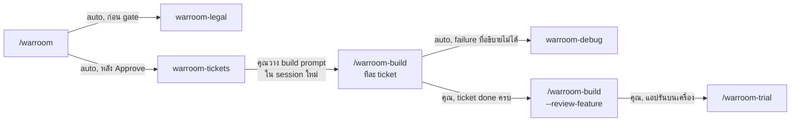
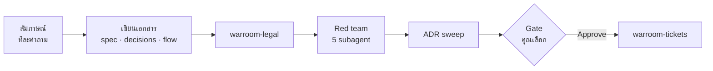
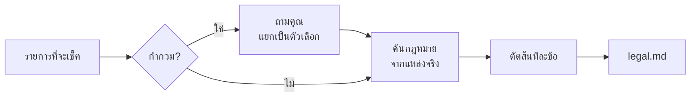
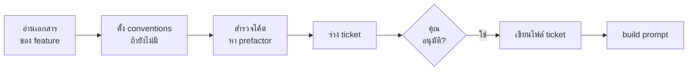
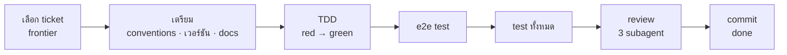
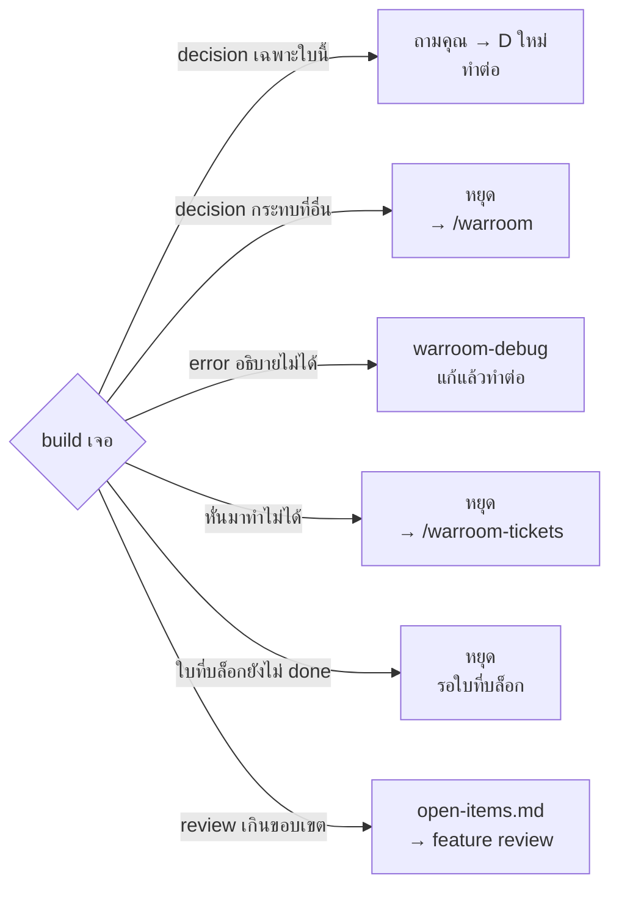
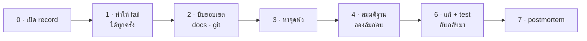
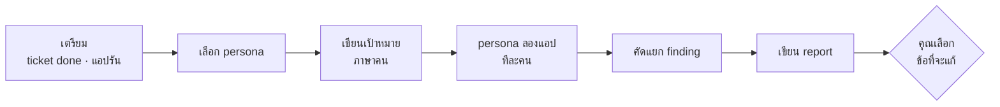
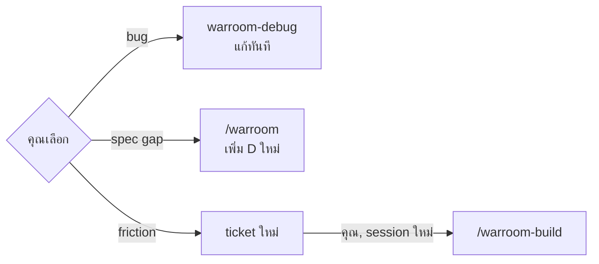

# skill ตระกูล warroom ทำงานต่อกันอย่างไร

[English](flow.md) · **ไทย**

คู่มือนี้ตอบ 3 คำถาม: ทำ feature หนึ่งตัวต้องรันอะไรตามลำดับไหน, แต่ละ skill
ข้างในทำอะไรบ้าง, และจุดไหนที่มันหยุดรอให้คุณตัดสินใจ

ตัวอย่างทั้งหมดใช้ feature `auth-user-company` ของ SKOPIA

## อ่านก่อน — ภาพรวมในหนึ่งย่อหน้า

คุณเล่าว่าอยากได้อะไร → **warroom** ถามทีละข้อแล้วเขียนแผนเป็นเอกสาร
→ **warroom-tickets** หั่นแผนเป็นงานชิ้นเล็กเรียงเลข 01, 02, …
→ **warroom-build** เขียนโค้ดทีละชิ้น ชิ้นละ session
→ ครบทุกชิ้นแล้ว **--review-feature** ตรวจทั้งก้อน
→ **warroom-trial** ให้ "ผู้ใช้สมมุติ" ลองใช้แอปจริง แล้วสรุปว่าติดตรงไหน
→ สิ่งที่เจอกลายเป็นงานชิ้นใหม่ แล้ววนกลับไป build

**warroom-legal** (กฎหมายไทย) กับ **warroom-debug** (ไล่หาสาเหตุ bug) เป็นตัวช่วย
ที่ skill อื่นเรียกใช้ระหว่างทาง

## ศัพท์ที่ต้องรู้

| คำ | ความหมาย |
|---|---|
| **feature / slug** | งานหนึ่งก้อน ตั้งชื่อเป็น slug เช่น `auth-user-company` เอกสารอยู่ที่ `docs/features/{slug}/` |
| **D{n}** | การตัดสินใจหนึ่งข้อใน `decisions.md` เช่น D28 "never expires = 400 วัน" |
| **ADR** | การตัดสินใจระดับโปรเจคที่ feature ถัดไปต้องทำตาม อยู่ใน `docs/adr/` |
| **seam** | จุดที่ test เข้าไปเช็คพฤติกรรมได้ (route ของ API, ฟังก์ชัน service) กำหนดไว้ใน spec.md |
| **(e2e)** | พฤติกรรมที่เห็นได้เฉพาะบนหน้าจอ ใช้ Playwright เปิด browser จริงเช็ค |
| **ticket** | งานหนึ่งชิ้นที่ทำแล้วใช้งานได้ตั้งแต่หน้าจอถึง database ไฟล์ `tickets/NN-*.md` |
| **Status** | สถานะ ticket: `ready-for-agent` (รอทำ) → `in-progress` → `done` |
| **Blocked by** | ticket ที่ต้องเสร็จก่อนถึงจะเริ่มใบนี้ได้ ชี้ไปเลขที่ต่ำกว่าเสมอ |
| **frontier** | ticket ที่เริ่มได้ตอนนี้: เลขต่ำสุดที่รอทำ และใบที่บล็อกมัน `done` หมดแล้ว |
| **prefactor** | ticket จัดโค้ดเดิมให้พร้อมก่อน เลขขึ้นก่อนเสมอ |
| **conventions** | กติกาเขียนโค้ดของโปรเจค เก็บใน `.claude/skills/{framework}-{surface}/` เช่น `elysia-api` |
| **persona** | ผู้ใช้สมมุติใน trial เช่น "เจ้าของบริษัทที่รีบเพิ่มพนักงานก่อนวันจันทร์" |
| **subagent** | Claude อีกตัวที่ skill ปล่อยออกไปทำงานแยก เห็นเฉพาะข้อมูลที่ส่งให้ |

## 1. เส้นทางทั้งหมด



**จากแผนถึง trial: ลูกศรที่เขียนว่า "auto" เกิดใน run เดียวกัน ส่วน "คุณ"
คือ skill หยุดรอคุณ**
- รัน `/warroom-build` ทีละ ticket แต่ละครั้งใน session ใหม่ จนทุก ticket
  เป็น `done` — build จะบอก ticket ถัดไปเมื่อเสร็จ
- warroom-debug ส่ง fix และ regression test กลับให้ build ที่เรียกมัน ถ้าเป็น
  bug นอก build ให้รัน `/warroom-debug` เอง
- warroom-legal รันเดี่ยวได้ด้วย `/warroom-legal {items หรือ slug}`
- trial เจออะไร → ดูหัวข้อ 7 ข้อที่คุณเลือกกลายเป็น ticket ใหม่ แล้ววนกลับไป
  `/warroom-build` → `--review-feature` → `/warroom-trial` อีกรอบ จนไม่มีอะไรสำคัญค้าง
  แล้วค่อย merge

**คำสั่งที่คุณพิมพ์จริง ตามลำดับ:**

```
/warroom                                        ← วางแผน + ได้ ticket (session เดียว)
/warroom-build auth-user-company                ← session ใหม่ ต่อ ticket หนึ่งใบ, ทำซ้ำจนครบ
/warroom-build auth-user-company --review-feature
/warroom-trial auth-user-company
```

## 2. warroom — วางแผน



ทุกขั้นอยู่ใน session เดียว — gate คือจุดเดียวที่คุณตัดสินใจ

| ขั้น | มันทำอะไร | คุณทำอะไร |
|---|---|---|
| สัมภาษณ์ | ถามทีละข้อ มีตัวเลือกพร้อมตัวที่แนะนำ | ตอบ / เลือก |
| เขียนเอกสาร | `spec.md` (ทำอะไร), `decisions.md` (D1, D2, …), `flow.md` (แผนภาพ) | — |
| warroom-legal | เช็คกฎหมายไทยทีละเรื่อง ได้ `legal.md` | ตอบถ้าข้อไหนกำกวม |
| Red team | subagent 5 ตัวหาช่องโหว่: Advocate (ผู้ใช้), Builder (ทำได้จริงไหม), Breaker (เจาะ), Tester (test ได้ไหม), Skeptic (จำเป็นไหม) | — |
| ADR sweep | หา decision ที่ควรเป็นกฎระดับโปรเจค ร่าง ADR | — |
| Gate | สรุปให้ดู | **Approve** = ไปต่อ / **Adjust** = แก้แล้วแสดง gate ใหม่ |

**ได้อะไร:** `docs/features/{slug}/` spec.md, decisions.md, flow.md, legal.md ·
`docs/adr/` · `CONTEXT.md`

## 3. warroom-legal — กฎหมายไทย



ทุกข้อได้คำตัดสินหนึ่งในสาม

- **ALLOWED** — ทำได้ บอกแค่มาตราอ้างอิง
- **NOT ALLOWED** — ทำไม่ได้ บอกเหตุผล
- **CONDITIONAL** — ทำได้ถ้ามีสิ่งที่ระบุ เช่น "ต้องมี privacy notice" — สิ่งเหล่านี้จะไปอยู่ใน spec และ ticket

รันเองได้: `/warroom-legal {รายการ หรือ slug}` · ไม่ใช่คำปรึกษาทางกฎหมาย

## 4. warroom-tickets — หั่นงาน



ร่างแล้วถามจนคุณพอใจ — แก้ได้หลายรอบก่อนเขียนไฟล์จริง

| ขั้น | มันทำอะไร | คุณทำอะไร |
|---|---|---|
| อ่านเอกสาร | spec, decisions, flow, legal, CONTEXT ถ้ามี `tickets/` แล้วถามว่าจะตัดใหม่ไหม | ตอบ |
| conventions | ส่วนไหนของแอปยังไม่มีกติกา (เช่น `tanstack-start-web`) → เสนอโครงโฟลเดอร์ + เครื่องมือ test | อนุมัติ / ปรับ |
| สำรวจโค้ด | หาโค้ดเดิมที่ต้องจัดก่อน → ticket prefactor เลขแรกๆ | — |
| ร่าง ticket | แต่ละใบทำงานได้ครบตั้งแต่หน้าจอถึง DB (ไม่ใช่ "ทำ DB ก่อนทั้งหมด") | — |
| ถาม | ใหญ่/เล็กไปไหม, ลำดับ Blocked by ถูกไหม, รวม/แยกใบไหน | ตอบจนพอใจ |
| เขียน | `tickets/NN-*.md` ทุกใบ `ready-for-agent` | — |
| build prompt | เช็คโปรเจค (commit เอกสารหรือยัง, branch, docker, test, เวอร์ชัน library, secret) แล้วให้ prompt ภาษาอังกฤษ | commit ตามขั้นที่บอก แล้ววาง prompt ใน session ใหม่ |

**ได้อะไร:** `tickets/NN-*.md` · `.claude/skills/{framework}-{surface}/` (ถ้าเพิ่งตั้ง) · ไม่ commit เอง

## 5. warroom-build — เขียนโค้ดหนึ่ง ticket



หนึ่ง session = หนึ่ง ticket — จบด้วย commit บน branch feature, ไม่ push

| ขั้น | มันทำอะไร | คุณทำอะไร |
|---|---|---|
| เลือก ticket | ใบที่ระบุ หรือ frontier ถ้าใบที่บล็อกยังไม่ done → หยุด | — |
| เตรียม | อ่าน conventions ของโปรเจค · ตารางเวอร์ชัน library (ติดตั้ง vs ล่าสุด) · อ่าน docs จริงของ library (`llms.txt` ก่อน) เขียนโน้ตใน `docs/reference/` | ตอบถ้าถามเรื่องอัปเกรด (แนะนำ: อยู่เวอร์ชันเดิม) |
| TDD | เกณฑ์ทีละข้อ: เขียน test ให้ fail (red) → เขียนโค้ดให้ผ่าน (green) | ตอบถ้ามีเรื่องที่เอกสารไม่ได้ตอบ → กลายเป็น D ใหม่ |
| e2e | เกณฑ์ที่มีป้าย `(e2e)` เขียน Playwright test หลังโค้ดผ่านแล้ว | — |
| test ทั้งหมด | full suite + typecheck + lint (+ e2e) | — |
| review | 3 subagent พร้อมกัน: **Standards** (ตรงกติกาไหม), **Spec** (ตรง ticket ไหม), **Newcomer** (คนไม่รู้เรื่องอ่านเข้าใจไหม) แก้ที่อยู่ในขอบเขต | — |
| commit | ticket เป็น `done` · `feat({slug}): {title} (#NN)` | ปิด session, เปิดใหม่สำหรับใบถัดไป |

- **test fail แบบอธิบายไม่ได้** → เรียก warroom-debug แล้วกลับมาทำต่อ
- **ครบทุกใบ** → `/warroom-build {slug} --review-feature`: review 3 แกนเดิมแต่ทั้ง branch
  หาปัญหาข้าม ticket (ทำซ้ำ 2 ที่, ตั้งชื่อต่างกัน) คุณเลือกข้อที่จะแก้ → commit `refactor({slug}): feature review fixes`

**ทำไมทีละ ticket ทีละ session**
- **context สะอาด** — session ยาวๆ Claude จะเริ่มลืมหรือสับสนของเก่ากับใหม่ เริ่มใหม่ทุกใบ อ่านเฉพาะที่ใบนั้นต้องใช้
- **review ได้ตรงจุด** — review ดู diff ตั้งแต่ commit ที่เริ่มใบนั้น ไม่ปนกับใบอื่น
- **ย้อนได้** — หนึ่งใบ = หนึ่ง commit ใบไหนพังก็ revert ใบนั้น
- **ความจำอยู่ในไฟล์ ไม่ใช่ในแชท** — ticket, decisions.md, `open-items.md` คือสิ่งที่ส่งต่อให้ session ถัดไป

## 5.1 build เจอเรื่องไม่ปกติ



build ไม่ออกแบบเอง — ทุกเรื่องที่ไม่จบในใบ ลง `open-items.md` พร้อมบอกว่าไปต่อทางไหน

| เจอ | build ทำ | ไปต่อ |
|---|---|---|
| decision **เฉพาะใบนี้** (ข้อความ error, ค่า default) | ถามคุณ → D ใหม่ `From: build ticket NN` | ทำต่อ |
| decision **กระทบที่อื่น** (spec, ใบอื่น, กฎหมาย, ADR, D เดิม) | หยุด · ไม่ตัดสินเอง | `/warroom` → legal + Breaker เช็ค → ตัดใหม่ |
| ไม่แน่ใจว่าแบบไหน | ถือว่ากระทบที่อื่น | `/warroom` |
| error อธิบายไม่ได้ | เรียก debug | ได้ fix → ทำต่อ |
| debug ทำ fail ซ้ำไม่ได้ | record `blocked` | คุณส่ง log ที่ขอ |
| ticket หั่นมาทำไม่ได้ | หยุด · `in-progress` | `/warroom-tickets` ตัดใหม่ |
| เอกสารผิด / ขัดกัน | หยุด | `/warroom` |
| ใบที่บล็อกยังไม่ done | หยุด · บอกชื่อใบ | build ใบนั้นก่อน |
| test พังอยู่ก่อนแล้ว | ไม่แก้ | `/warroom-debug` |
| review เกินขอบเขตใบ | แก้เฉพาะในใบ | `--review-feature` |
| ใหญ่ ทำไม่จบใน session | หยุดท้ายกลุ่มเกณฑ์ | session ใหม่ ทำต่อ |

**`open-items.md` — งานค้างทั้ง feature ในตารางเดียว**

```
| # | Ticket | From         | Found                       | Next               | Status    |
| 1 | 04     | build stop   | ต้องมี session store ก่อน      | → /warroom-tickets | → ticket 05 |
| 2 | 04     | review: Spec | ...                         | → feature review   | open      |
| 3 | 06     | decision     | suspend แล้ว logout ทันทีไหม  | → /warroom         | → D32     |
```

- **From** มาจากไหน · **Next** flow ที่ปิดมัน · **Status** `open` จนกว่า flow นั้นปิด
- skill ที่ปิดเป็นคนแก้ Status: `/warroom-tickets` → `→ ticket NN` · `/warroom` → `→ D{n}` · `--review-feature` → `done (sha)`

**งานค้างอยู่ตรงไหน**

| ค้างที่ | มาจาก | ใครปิด |
|---|---|---|
| `open-items.md` | build, review, feature review | ตาม Next ของแต่ละแถว |
| ticket `in-progress` | build ที่หยุด | `/warroom-build` อ่านแถวของใบนั้นแล้วถามว่าทำต่อไหม |
| `trial/{date}.md` แถว `open` | trial ที่คุณไม่ได้เลือก | trial รอบหน้า / คุณเลือกทีหลัง |
| `docs/debug/` `blocked` | debug ที่ติด | `/warroom-debug` เมื่อได้ข้อมูล |
| `docs/debug/` `spec gap → warroom` | debug ที่พบว่าเอกสารผิด | `/warroom` |

`/warroom` บน feature เดิม: รวบรวมแถว `→ /warroom` ทุกแหล่ง ถามเฉพาะเรื่องนั้น →
D ใหม่ → legal + Breaker → gate → ตัด ticket ใหม่

## 6. warroom-debug — ไล่หาสาเหตุ bug



ห้ามเดาสาเหตุก่อนทำให้ fail ได้ทุกครั้ง — ทุกขั้นเขียนลง `docs/debug/{date}-{slug}.md` ทันที

- **ขั้น 1 ทำ fail ไม่ได้** → หยุด ขอ log / ข้อมูลเพิ่มจากคุณ ไม่เดา
- **ขั้น 2 โค้ดทำตามเอกสารเป๊ะ** → ไม่ใช่ bug แต่เป็น spec gap → แนะนำ `/warroom`
- **ขั้น 4–5** ทุกการทดลองจดลง ledger (ตาราง) สมมติฐานต้องอธิบายได้ทุกแถว
  มี subagent **Outsider** อ่านแค่ record แล้วให้ความเห็นมุมคนนอก
- **ขั้น 7** สรุปแบบไม่โทษใคร: ระบบปล่อยให้เกิดได้อย่างไร กันไม่ให้เกิดซ้ำอย่างไร
  งานกันที่ต้องทำเพิ่ม → ถามคุณก่อน ตอบใช่ถึงเป็น ticket ใหม่
- **commit:** ถูก build เรียก → fix เข้า commit ของ ticket · รันเอง → commit fix + test + record พร้อมกัน

## 7. warroom-trial — ผู้ใช้สมมุติลองแอปจริง



trial ไม่แก้อะไรเอง — เขียน report แล้วให้คุณเลือก

| ขั้น | มันทำอะไร | คุณทำอะไร |
|---|---|---|
| เตรียม | ลองเฉพาะ ticket `done` บอกว่าข้ามใบไหนเพราะอะไร · รันแอปบนเครื่อง (localhost เท่านั้น, ข้อมูลทดสอบเท่านั้น) · mobile ใช้ dev build ใน simulator | สั่ง docker / ตอบถ้าถาม |
| เลือก persona | จาก actor ใน spec + บทบาทจริงที่คุณบอก (ผู้จัดการ, พนักงานวันแรก, คนรีบใช้บนมือถือ) 3–5 คน | ติ๊กเลือก |
| เป้าหมาย | 3–6 ข้อต่อคน เป็นภาษาคน เช่น "ต้องเพิ่มพนักงานใหม่ก่อนวันจันทร์" ไม่ใช่ "กดปุ่ม Create" | ดู / ปรับ |
| ลองแอป | subagent ละคน **ไม่เห็นโค้ด ไม่เห็น spec** ใช้ browser จริง ตอบเป็นภาษาไทยเหมือนผู้ใช้จริง | — |
| คัดแยก | ทำตัวเป็น dev lead เทียบกับ spec แล้วแยกประเภท (ตารางล่าง) รวมข้อซ้ำ นับคนที่เจอ | — |
| report | `trial/{date}.md` เรียงข้อที่ทำให้งานไม่สำเร็จก่อน | — |
| เลือก | ถามว่าจะจัดการข้อไหนตอนนี้ | ติ๊กเลือก |

**finding แต่ละแบบไปไหน:**



ข้อที่ไม่เลือกค้างใน report เป็น `open`

| ประเภท | ความหมาย | ไปต่อ |
|---|---|---|
| **bug** | แอปทำไม่ตรง spec | debug ทำ repro จากขั้นตอน persona แก้พร้อม test (e2e ถ้าเจอบนจอ) แล้ว commit |
| **spec gap** | spec ไม่ได้พูดถึง หรือผิด สำหรับงานจริง | trial ไม่แก้ spec · คุณรัน `/warroom` เพิ่ม D แล้วตัด ticket |
| **friction** | ตรง spec แต่ใช้ยาก / งง | ticket ใหม่ต่อเลขสุดท้าย มีเป้าหมาย persona เป็นเกณฑ์ `(e2e)` |
| **works as intended** | ผู้ใช้คาดหวังสิ่งที่ D ตัดออกไปแล้ว | จดไว้ อ้าง D |

**หลังเลือก:** trial ไม่ commit — commit report + ticket ใหม่เอง แล้ว build ticket ใหม่ →
`--review-feature` → trial อีกรอบ

## แต่ละ skill โดยย่อ

| Skill | คุณเริ่มด้วย | เรียกต่อเอง | หยุดเมื่อ | แล้วคุณ |
|---|---|---|---|---|
| `warroom` | `/warroom` | warroom-legal, red-team 5 subagent, Successor subagent, warroom-tickets | เขียน ticket เสร็จ | วาง build prompt ใน session ใหม่ |
| `warroom-legal` | รันใน warroom หรือ `/warroom-legal` | — | เขียน `legal.md` เสร็จ | — (warroom ทำต่อ) |
| `warroom-tickets` | รันหลัง gate ของ warroom หรือ `/warroom-tickets {slug}` | — | แสดง ticket + build prompt | commit เอกสาร แล้ววาง prompt |
| `warroom-build` | `/warroom-build {slug} [NN]` หรือ prompt ที่วาง | review subagent Standards / Spec / Newcomer, warroom-debug | commit ticket หนึ่งใบแล้ว | เปิด session ใหม่สำหรับใบถัดไป |
| `warroom-build --review-feature` | `/warroom-build {slug} --review-feature` | review subagent สามตัวเดิม | commit fix ที่เลือกแล้ว | รัน trial หรือ merge |
| `warroom-debug` | build / trial เรียก หรือ `/warroom-debug` | Outsider subagent | fix + test + record | — (build ทำต่อ) |
| `warroom-trial` | `/warroom-trial {slug}` | persona subagent ทีละตัว, warroom-debug | report + ส่งข้อที่เลือกต่อแล้ว | commit, build ticket ใหม่ หรือรัน warroom |

## แต่ละตัวทิ้งไฟล์อะไรไว้

| Skill | ไฟล์ |
|---|---|
| `warroom` | `docs/features/{slug}/` spec.md, decisions.md, flow.md · `docs/adr/` · `CONTEXT.md` |
| `warroom-legal` | `docs/features/{slug}/legal.md` |
| `warroom-tickets` | `docs/features/{slug}/tickets/NN-*.md` · `.claude/skills/{framework}-{surface}/` (เมื่อยังไม่มี) |
| `warroom-build` | code + test หนึ่ง commit ต่อ ticket · โน้ตใน `docs/reference/` · `docs/features/{slug}/open-items.md` (เมื่อมีงานค้าง) |
| `warroom-debug` | `docs/debug/{date}-{slug}.md` |
| `warroom-trial` | `docs/features/{slug}/trial/{date}.md` · ticket ใหม่จาก friction ที่เลือก |
