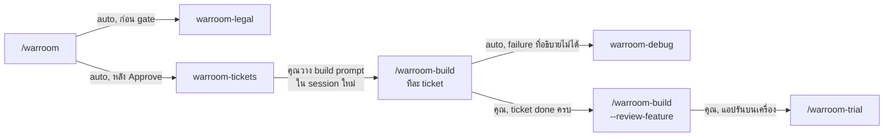
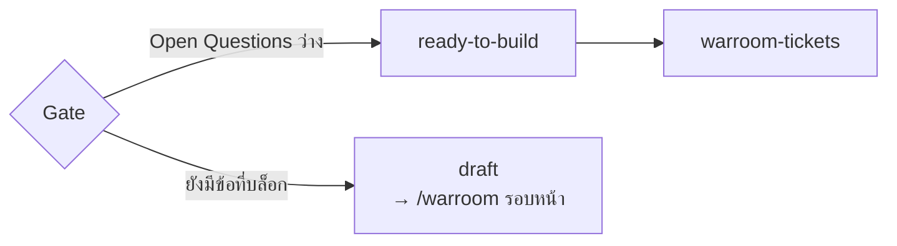
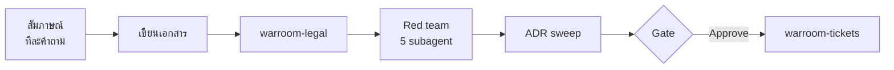
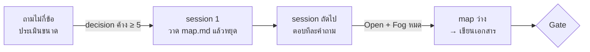
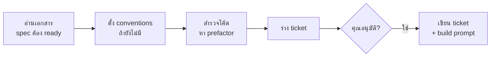
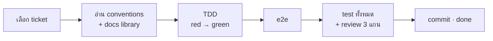
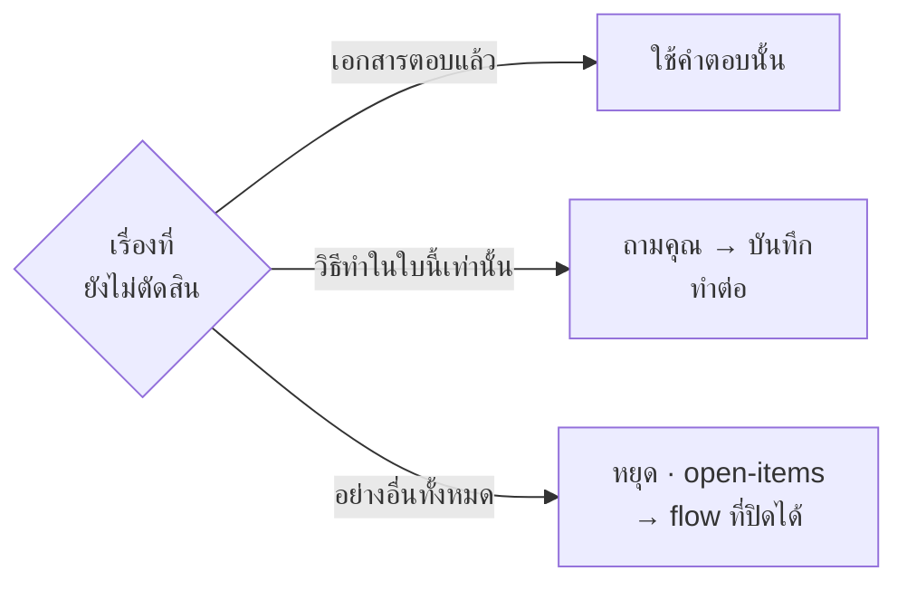
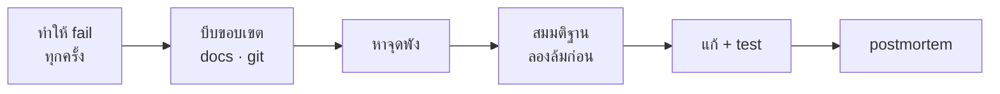
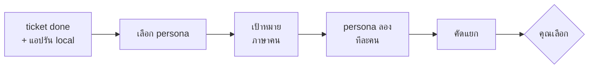

# skill ตระกูล warroom ทำงานต่อกันอย่างไร

[English](flow.md) · **ไทย**

รันอะไร ลำดับไหน, แต่ละ skill ทำอะไร, หยุดรอคุณตรงไหน

**หลักจำง่าย:** วางแผนต่อกันเอง (warroom → legal → tickets) · build ทีละ
ticket ทีละ **session ใหม่** · debug เริ่มเองเมื่อ build เจอ error ที่อธิบายไม่ได้ ·
trial คุณสั่งเสมอ

## 1. เส้นทางทั้งหมด



**"auto" = ต่อกันใน session เดียว · "คุณ" = skill หยุดรอคุณ**
- `/warroom-build` ทีละ ticket แต่ละครั้ง session ใหม่ จนครบ
- trial เจออะไร → หัวข้อ 8 · ข้อที่เลือกกลายเป็น ticket ใหม่ แล้ววน build →
  review → trial จนเรียบร้อย แล้ว merge
- legal กับ debug รันเดี่ยวได้: `/warroom-legal`, `/warroom-debug`

**คำสั่งที่พิมพ์จริง:**

```
/warroom                                          ← วางแผน + ได้ ticket
/warroom-build auth-user-company                  ← session ใหม่ต่อ ticket, ทำซ้ำจนครบ
/warroom-build auth-user-company --review-feature
/warroom-trial auth-user-company
```

## 2. ด่านเดียวที่ต้นทาง — spec ต้อง ready ก่อน



คำถามที่ไม่ถูกถามตอนวางแผน จะไปโผล่ตอน build — กลางโค้ด, context ใกล้เต็ม,
ไม่มี red team กับ legal เช็ค เลยกันไว้ที่ต้นทาง

- spec มี `Status: draft | ready-to-build` และ `## Open Questions`
- gate กด **Approve** ได้เมื่อ Open Questions ว่าง (หรือทุกข้อบอกว่าไม่บล็อก)
- ยังไม่พร้อม → **Stop as draft** ได้ prompt กลับมา `/warroom` พร้อมรายการคำถาม
- tickets และ build **ไม่รับ** spec ที่เป็น `draft`

## 3. warroom — วางแผน



ทุกขั้นใน session เดียว — gate คือจุดเดียวที่คุณตัดสิน

| ขั้น | ทำอะไร | คุณ |
|---|---|---|
| สัมภาษณ์ | ถามทีละข้อ มีตัวเลือกแนะนำ · ค้นโค้ด / ADR / docs ก่อนถาม · ตอบไม่ได้ → Open Question | ตอบ |
| เขียนเอกสาร | spec (มี Library assumptions + Testing decisions), decisions (D1…), flow | — |
| legal | กฎหมายไทยทีละเรื่อง → `legal.md` | ตอบถ้ากำกวม |
| Red team | Advocate (ผู้ใช้) · **Builder** (เปิด docs library จริง, เดินงานแทนคนทำหาเรื่องที่ต้องถาม) · Breaker (เจาะ) · Tester (test ได้ไหม) · Skeptic (จำเป็นไหม) | ตอบเรื่องที่ต้องตัดสิน |
| ADR sweep | หา decision ที่เป็นกฎระดับโปรเจค ร่าง ADR | — |
| Gate | สรุป + Open Questions | **Approve** / **Adjust** / **Stop as draft** |

**ได้:** `docs/features/{slug}/` spec, decisions, flow, legal · `docs/adr/` · `CONTEXT.md`

**เปิด feature เดิม** (`/warroom {slug}`): ถามเฉพาะแถว `→ /warroom` ใน
`open-items.md` + Open Questions → D ใหม่ → legal + Breaker → gate → ตัด ticket ใหม่

### 3.1 map mode — งานใหญ่เกิน session เดียว



decision ค้างราว 5 ข้อขึ้นไป และตอบแล้วจะมีคำถามใหม่ตามมา → วาดแผนที่ก่อน
แทนที่จะถามจน context หมด

| ส่วนใน `map.md` | มีอะไร |
|---|---|
| Destination | ปลายทาง เช่น "spec ที่ ready-to-build สำหรับ …" กำหนดขอบเขต |
| Decided | หนึ่งบรรทัดต่อข้อ ลิงก์ไป D |
| Open | คำถามที่พูดได้ชัดแล้ว + ชนิด (interview / sketch / research / task) + รอข้อไหน |
| Fog | เรื่องที่รู้ว่ามาแน่ แต่ยังตั้งเป็นคำถามไม่ได้ |
| Out of scope | เลยปลายทาง ไม่กลับมาอีก |

- session 1 วาดแล้ว **หยุด** · session ถัดไป `/warroom {slug}` ตอบทีละข้อ **บันทึกก่อนทำอย่างอื่น**
- Open + Fog หมด → เขียนเอกสาร → legal → red team → ADR → gate ตามปกติ

**เพิ่มในการสัมภาษณ์ทุกแบบ:** ถามเรื่องคุณภาพ 2–3 ข้อที่ feature นี้กระทบจริง
(เร็ว/โหลด, ระบบที่พึ่งล่ม, ใครเห็นข้อมูล) · ไม่แต่งเหตุผลให้ — ไม่มีก็เขียน
`rationale not recorded` · พูดไม่พอ → ร่างหยาบ (ตารางสถานะ, mockup ข้อความ) ไม่ใช่โค้ด ·
seam เลือกตัวที่มีอยู่แล้ว สูงสุด น้อยสุด · เปลี่ยนทิศทั้งก้อน = feature ใหม่

## 4. warroom-legal — กฎหมายไทย

ทีละเรื่อง ได้คำตัดสินเดียว: **ALLOWED** (อ้างมาตรา) · **NOT ALLOWED** (เหตุผล) ·
**CONDITIONAL** (ต้องมีอะไร → เข้า spec และ ticket) · ข้อกำกวมถามคุณ ไม่เดา ·
ไม่ใช่คำปรึกษาทางกฎหมาย

## 5. warroom-tickets — หั่นงาน



| ขั้น | ทำอะไร | คุณ |
|---|---|---|
| อ่าน | spec `draft` → หยุด ส่ง `/warroom` · มี ticket อยู่แล้ว → ถามตัดใหม่ไหม (ใบที่ยังไม่ done เรียงเลขใหม่) | ตอบ |
| conventions | ส่วนไหนยังไม่มีกติกา → เสนอโครงโฟลเดอร์ + เครื่องมือ test → `.claude/skills/{framework}-{surface}/` | อนุมัติ / ปรับ |
| สำรวจโค้ด | โค้ดเดิมที่ต้องจัด → ticket prefactor เลขแรก | — |
| ร่าง | แต่ละใบครบหน้าจอถึง DB · เดินทุกใบแทนคนทำ: เรื่องโครงสร้าง → ใส่ conventions เลย · เรื่องพฤติกรรม → ส่งกลับ `/warroom` | — |
| อนุมัติ | ใหญ่/เล็ก, Blocked by, รวม/แยก | ตอบจนพอใจ |
| เขียน | `tickets/NN-*.md` + build prompt (เช็ค commit เอกสาร, branch, docker, secret, งานค้าง) | commit แล้ววาง prompt ใน session ใหม่ |

## 6. warroom-build — ทีละ ticket



**ทำไมทีละ ticket ทีละ session:** context สะอาด อ่านเฉพาะที่ใบนั้นใช้ · review
ดูเฉพาะ diff ของใบนั้น · หนึ่งใบหนึ่ง commit ย้อนได้ทีละใบ · ความจำอยู่ในไฟล์
(ticket, decisions, open-items) ไม่ใช่แชท

| ขั้น | ทำอะไร | คุณ |
|---|---|---|
| เลือก | ใบที่ระบุ หรือเลขต่ำสุดที่เริ่มได้ · ใบค้าง `in-progress` → อ่านแถวใน open-items แล้วถามทำต่อไหม | — |
| เตรียม | conventions (ไม่มี → หยุด → `/warroom-tickets`) · ตารางเวอร์ชัน · โน้ต `docs/reference/` ของเวอร์ชันที่ติดตั้ง | ตอบเรื่องอัปเกรด (แนะนำ: อยู่เดิม) |
| TDD | เกณฑ์ทีละข้อ red → green ที่ seam ที่ตกลงไว้ | — |
| e2e | เกณฑ์ `(e2e)` เขียนหลังโค้ดผ่าน | — |
| ตรวจ | full suite + typecheck + lint · review **Standards / Spec / Newcomer** พร้อมกัน | — |
| commit | `feat({slug}): {title} (#NN)` · ไม่ push | session ใหม่ ใบถัดไป |

**ครบทุกใบ** → `--review-feature`: review 3 แกนทั้ง branch + แถว `→ feature review`
ใน open-items → คุณเลือกข้อที่แก้

### 6.1 build เจอเรื่องที่เอกสารไม่ได้ตัดสิน



**build ทำตาม decision ไม่สร้าง decision** — decision ที่ทำตอน build ข้าม red team
และ legal

| กรณี | build ทำ |
|---|---|
| ค้นแล้วเจอ (decisions ทั้งไฟล์, ADR, spec, conventions, reference) | ใช้เลย ไม่ถาม |
| วิธีทำในใบนี้เท่านั้น (ข้อความ error, ค่า default, pattern ของ layer ใหม่) | ถาม บอกว่าค้นที่ไหนแล้ว → D ใหม่ หรือ conventions ตอบให้จบ → ทำต่อ |
| กระทบ spec / ใบอื่น / legal / ADR / D เดิม · หั่นมาทำไม่ได้ · เอกสารขัดกัน · ไม่แน่ใจ | หยุด → แถวใน open-items (`→ /warroom` หรือ `→ /warroom-tickets`) |
| error อธิบายไม่ได้ | เรียก debug → ได้ fix → ทำต่อ |
| test พังอยู่ก่อนแล้ว | ไม่แก้ → แถว `→ /warroom-debug` |
| review เกินขอบเขตใบ | แถว `→ feature review` |
| ใหญ่ ทำไม่จบ | หยุดท้ายกลุ่มเกณฑ์ commit ส่วนที่ผ่านเป็น `wip` · แถว `→ /warroom-build` |

**ไม่จบ session ทั้งที่โค้ดยังไม่ commit** — ถาม: เก็บไว้ branch `wip/{slug}-{NN}`
(แนะนำ) หรือทิ้ง · จดชื่อ branch ในแถว

## 7. warroom-debug — หาสาเหตุ bug



ไม่เดาก่อนทำ fail ได้ · ทุกขั้นจดใน `docs/debug/{date}-{slug}.md` ทันที

- ทำ fail ไม่ได้ → หยุด ขอ log · แถว `→ /warroom-debug`
- โค้ดตรงเอกสารเป๊ะ → ไม่ใช่ bug แต่ spec gap · แถว `→ /warroom`
- ทุกการทดลองจดลง ledger · subagent **Outsider** อ่านแค่ record ให้ความเห็นคนนอก
- postmortem ไม่โทษใคร · งานป้องกันถามคุณก่อน ตอบใช่ถึงเป็น ticket

## 8. warroom-trial — ผู้ใช้สมมุติลองแอป



persona เป็น subagent **ไม่เห็นโค้ด ไม่เห็น spec** ใช้ browser จริง ตอบภาษาเดียวกับแอป ·
trial ไม่แก้อะไรเอง

| ประเภท | ความหมาย | เลือกแล้วไปไหน |
|---|---|---|
| **bug** | แอปไม่ตรง spec | debug ทันที แก้ + test (e2e ถ้าเห็นบนจอ) |
| **spec gap** | spec ไม่ได้พูด / ผิด | แถว `→ /warroom` |
| **friction** | ตรง spec แต่ใช้ยาก | ticket ใหม่ มีเกณฑ์ `(e2e)` |
| **works as intended** | คาดหวังสิ่งที่ D ตัดไปแล้ว | จดไว้ อ้าง D |

ข้อที่ไม่เลือก → `open` ใน `trial/{date}.md` · trial ไม่ commit

## 9. `open-items.md` — งานค้างทั้ง feature ที่เดียว

```
| # | Ticket | From         | Found                       | Next               | Status      |
| 1 | 04     | build stop   | ต้องมี session store ก่อน      | → /warroom-tickets | → ticket 05 |
| 2 | 04     | review: Spec | ...                         | → feature review   | open        |
| 3 | 06     | decision     | suspend แล้ว logout ทันทีไหม  | → /warroom         | → D32       |
| 4 | —      | trial        | ...                         | → /warroom         | open        |
```

| คอลัมน์ | ความหมาย |
|---|---|
| **From** | มาจากไหน: `build stop`, `decision`, `review: {แกน}`, `feature review`, `full suite`, `debug`, `trial` |
| **Next** | flow ที่ปิดมัน: `→ /warroom`, `→ /warroom-tickets`, `→ /warroom-debug`, `→ /warroom-build`, `→ feature review` |
| **Status** | `open` จน flow นั้นปิด → `→ ticket NN` / `→ D{n}` / `done (sha)` / `dropped (เหตุผล)` |

skill ที่ปิดเป็นคนแก้ Status · build prompt ไม่ออกถ้ามีแถว `→ /warroom` หรือ
`→ /warroom-tickets` ค้าง · `--review-feature` ไม่แนะนำ merge ถ้ายังมีแถว `open`

## ศัพท์

| คำ | ความหมาย |
|---|---|
| **D{n}** | decision หนึ่งข้อใน `decisions.md` |
| **ADR** | กฎระดับโปรเจคที่ feature ถัดไปต้องตาม (`docs/adr/`) |
| **seam** | จุดที่ test เช็คพฤติกรรม (route, service) ตกลงไว้ใน spec |
| **(e2e)** | พฤติกรรมที่เห็นได้บนจอเท่านั้น เช็คด้วยเครื่องมือ e2e ของโปรเจค (เช่น Playwright) |
| **Blocked by** | ticket ที่ต้องเสร็จก่อน ชี้เลขต่ำกว่าเสมอ |
| **frontier** | ticket ที่เริ่มได้ตอนนี้ |
| **prefactor** | ticket จัดโค้ดเดิมก่อน เลขแรกเสมอ |
| **conventions** | กติกาเขียนโค้ดของโปรเจค `.claude/skills/{framework}-{surface}/` |
| **persona** | ผู้ใช้สมมุติใน trial |

## แต่ละ skill ทิ้งอะไรไว้

| Skill | ไฟล์ |
|---|---|
| `warroom` | `docs/features/{slug}/` spec, decisions, flow (+ `map.md` งานใหญ่) · `docs/adr/` · `CONTEXT.md` |
| `warroom-legal` | `legal.md` |
| `warroom-tickets` | `tickets/NN-*.md` · `.claude/skills/{framework}-{surface}/` |
| `warroom-build` | code + test หนึ่ง commit ต่อใบ · `docs/reference/` · แถวใน `open-items.md` |
| `warroom-debug` | `docs/debug/{date}-{slug}.md` · แถวใน `open-items.md` |
| `warroom-trial` | `trial/{date}.md` · ticket ใหม่ · แถวใน `open-items.md` |
